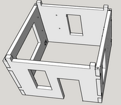
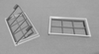
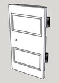

# Smarthome-1x1-Module

Maqueta de Casa Domótica Educativa en construcció 

Realitzada per [Jordi Mayné](https://github.com/maynej) des de Mechatronic Study jordi.mayne@mechatronicstudy.com 

L'objectiu es construir una casa modular abstreta del projecte del Parc mediambiental educatiu on permet provar diferents tecnologies de control aplicant la domòtica, gestionant el medi ambient i mesurant paràmetres de la natura.

Tota la [documentació es pot trobar en PDF](https://github.com/maynej/Smart-1x1-Module/tree/main/DOC). També en llengua castellana.

STL per imprimir [aquí](https://github.com/maynej/Smart-1x1-Module/tree/main/STL_SMARTHOME).

## Casa 3D 
  
Descripció         | Imatge          | Arxiu         
------------- | ------------- | ------------- 
Parets | | [Parets](STL_SMARTHOME/Casa/Parets)
Finestres | | [Finestres](STL_SMARTHOME/Casa/Finestres)
Portes | | [Portes](STL_SMARTHOME/Casa/Portes)
Teulades |  | [Teulades](STL_SMARTHOME/Casa/Teulada)

Creative Commons Attribution-NoComercial-ShareAlike 4.0 International (CC BY-NC-SA 4.0)  

## QR
