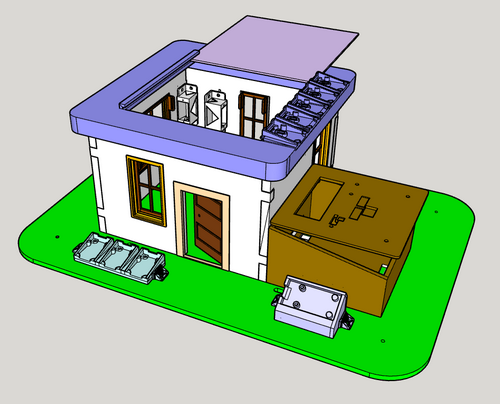
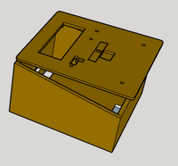
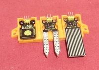

# Smarthome-1x1-Module

Maqueta de Casa Domótica Educativa en construcció 

   

Realitzada per [Jordi Mayné](https://github.com/maynej) des de Mechatronic Study jordi.mayne@mechatronicstudy.com 

L'objectiu es construir una casa modular abstreta del projecte del Parc mediambiental educatiu on permet provar diferents tecnologies de control aplicant la domòtica, gestionant el medi ambient i mesurant paràmetres de la natura.

Tota la [documentació es pot trobar en PDF](https://github.com/maynej/Smarthome-1x1-Module/tree/main/DOC). També estarà en llengua castellana (en preparació).

STL per imprimir [aquí](https://github.com/maynej/Smarthome-1x1-Module/tree/main/STL).

## Casa 3D 
  
Descripció         | Imatge          | Arxiu         
------------- | ------------- | ------------- 
Parets | | [Parets](STL/Parets)
Finestres | | [Finestres](STL/Finestres)
Porta | | [Porta](STL/Porta)
Teulada | | [Teulada](STL/Teulada)
Capsa Control | | [Capsa CPU](STL/CPU)
Suport 1 forat | | [Suport 1 forat](STL/Suport1forat.stl)
Suport Inclinat 1 forat | | [Suport Inclinat 1 forat](STL/SuportInclinat1forat.stl)
Suport 2 forats | | [Suport 2 forats](STL/Suport2forats.stl)
Suport RFID | | [RFID](STL/SuportRFID.stl)

## Base de fusta  
  
Descripció         | Imatge          | Arxiu         
------------- | ------------- | ------------- 
Base fusta |

## Parets sólides
Descripció         | Imatge          | Arxiu         
------------- | ------------- | ------------- 
Parets | | [Parets](STL/Parets)

Creative Commons Attribution-NoComercial-ShareAlike 4.0 International (CC BY-NC-SA 4.0)  

## QR

